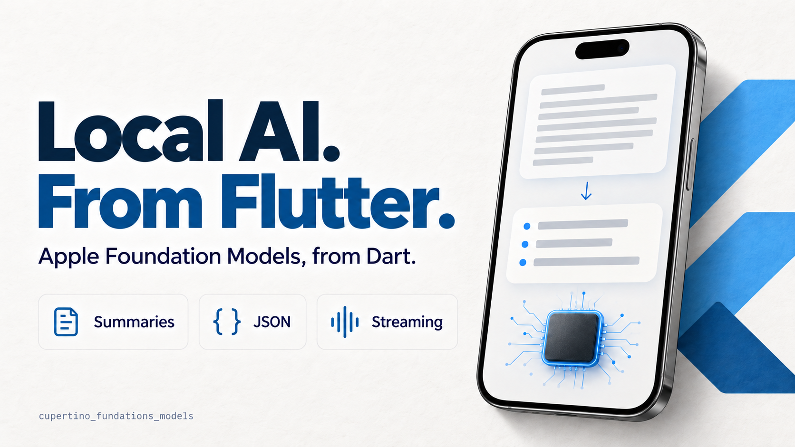

# Hashnode article draft — awaiting owner review

Prepared September 30, 2026. Not published. The owner created the account;
the free publication is [sooyvilla.hashnode.dev](https://sooyvilla.hashnode.dev/).
The title and body were entered into the
[draft editor](https://hashnode.com/draft/6abd6426f559c2ae6c591d9c).
Hashnode's Drafts list confirmed the saved article and zero published articles;
reopening restored the title and 764-word body.
The owner must review the complete article and its
cover before publication. The English article addresses developers looking
for a Flutter integration.

Proposed editor fields:

- Title: Local AI in Flutter: summaries powered by the iPhone
- Slug: `flutter-ios-on-device-ai-apple-foundation-models`
- Description: Add a local summary to a Flutter iOS app with Apple Foundation Models, availability checks, error handling and session cleanup.
- Tags: Flutter, Dart, iOS, AI. Select the matching tags offered by the editor.
- Cover: [English illustration](assets/local-ai-flutter-hashnode-en.png).
- Cover alt text: Local AI from Flutter: an illustrative iPhone turns a passage
  into a summary, with JSON and streaming labels. Package cupertino_fundations_models.
- Original URL: leave unset for this new article. It cites documentation but
  is not a republication of a previously published blog article.

The article starts below. These preparation notes are not part of the post.

Cover proposed for owner review; upload is pending the Chrome file-URL setting:



---

# Local AI in Flutter: summaries powered by the iPhone

Your Flutter app already has the text. The iPhone can turn it into a short
summary using Apple's on-device language model. Local generation needs no
external AI API key.

I built
[`cupertino_fundations_models`](https://pub.dev/packages/cupertino_fundations_models),
an open-source bridge from Dart to Apple's Foundation Models framework.
It lets a Flutter iOS app summarize text, classify notes and extract structured
data through the native model. Here's a small summary function you can adapt
to your app.

## First, check the device

You need an Apple Intelligence device with Foundation Models available,
appropriate settings, a supported language and downloaded model assets.
Installing the app does not establish whether generation is available.

Ask native availability before offering the feature. If the model is not
ready, keep the original note and the usual editing flow available. Requests
can still fail after that check, so handle generation errors as well.

Apple manages the model assets. Your app uses its native framework through
the plugin rather than bundling custom model weights. The
[setup guide](https://sooyvilla.github.io/cupertino_fundations_models/local-ai-ios/)
has the build requirements and compatibility details.

## Install the bridge

From your Flutter app:

```sh
flutter pub add cupertino_fundations_models
```

The identifier uses the existing spelling `fundations`. Copy it exactly.
Rebuild the iOS host after adding the native plugin; hot reload cannot install
its Swift bridge.

## Generate a short summary

The function checks availability, creates a local session and releases it
when finished. Give it a short passage; the instructions ask for three bullets
using only the facts in that passage.

```dart
import 'package:cupertino_fundations_models/cupertino_fundations_models.dart';

Future<String?> summarizeOnDevice(String text) async {
  final models = CupertinoFoundationModels();
  FoundationModelSession? session;
  try {
    final availability = await models.checkAvailability(
      mode: ModelMode.local,
      cloudPolicy: CloudPolicy.never,
      localeIdentifier: 'en_US',
    );
    if (!availability.isAvailable) return null;

    session = await models.createSession(
      options: const SessionOptions(
        mode: ModelMode.local,
        cloudPolicy: CloudPolicy.never,
        localeIdentifier: 'en_US',
        instructions:
            'Summarize the supplied passage in three short English bullets. '
            'Use only facts present in the passage.',
      ),
    );
    final response = await session.respond(
      Prompt.text(text),
      options: const GenerationOptions(maximumResponseTokens: 180),
    );
    return response.text;
  } on FoundationModelsException {
    return null;
  } finally {
    await session?.dispose();
  }
}
```

Show the returned summary alongside the original text so the user can review
it. If the result is null, leave the manual flow available. In a fuller app,
use the typed error code to explain failures and handle cleanup errors too.

The response token limit keeps the output short. It does not prove that a
large input fits the model's context. Keep the passage small and reserve room
for the instructions and response. Change the locale and instructions together
when adapting the example to another supported language.

## What local-only means here

`ModelMode.local` and `CloudPolicy.never` explicitly select local generation.
It needs no external AI API key, and the package does not automatically send
an unsuccessful request to another provider.

Initial model downloads may require internet. After the assets are ready,
local inference can work offline. A tool supplied by your app can still call
a network service, and Speech recognition has a separate privacy policy.
Optional Private Cloud Compute has separate access requirements and is not
needed for this summary function.

The local model policy governs generation, not every network operation your
app might perform.

## Move from text to structured data

For a note category or a small extraction task, use
`generateStructured()` with a supported `StructuredSchema`. A schema is a
better contract than a prompt that simply asks the model to “return JSON.”

The [task recipes](https://sooyvilla.github.io/cupertino_fundations_models/recipes/)
show complete extraction and classification functions. They constrain the
shape of the output and check the decoded value before returning it.

A matching schema establishes structure, not factual accuracy. Keep the
source text available for review and let users correct suggestions before
the app acts on them. An ambiguous note should have a useful default rather
than being forced into a category.

## Add it to the app deliberately

Each session handles one request at a time. If you add streaming, replace
the displayed text with each cumulative snapshot and use the completion
response as the final result. Await cancellation and cleanup before reusing
a session.

The plugin targets Flutter iOS and generation is limited to compatible
devices. Start with a feature whose result the user can inspect: a summary,
a note category or a few extracted fields. The app remains responsible for
checking that result before using it.

The snippet above was reviewed against the package source and has not been
run as part of this article preparation. Evaluate it on your supported devices,
languages and inputs before shipping it in an app.

The [usage reference](https://sooyvilla.github.io/cupertino_fundations_models/usage/),
[example source](https://github.com/sooyvilla/cupertino_fundations_models/tree/main/example)
and [Apple framework documentation](https://developer.apple.com/documentation/foundationmodels)
cover the next integration steps.
